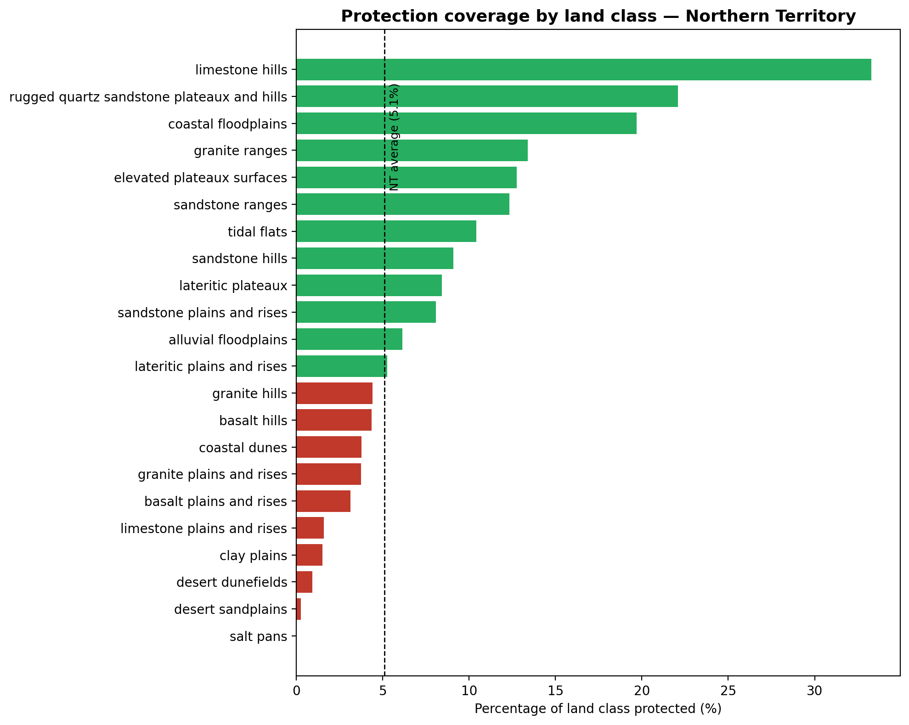
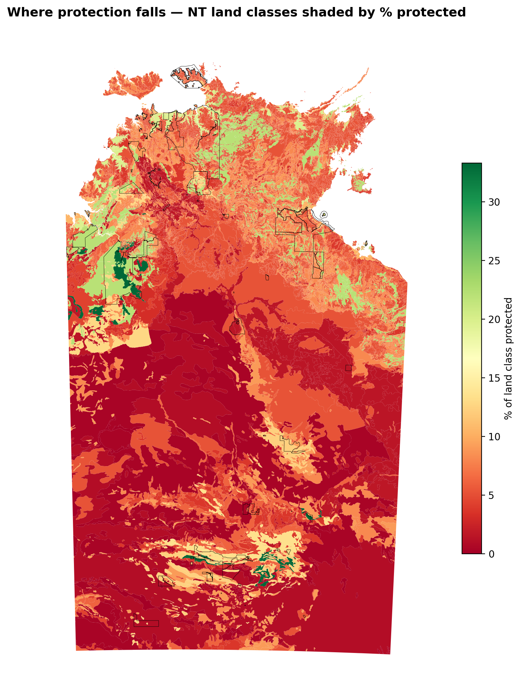
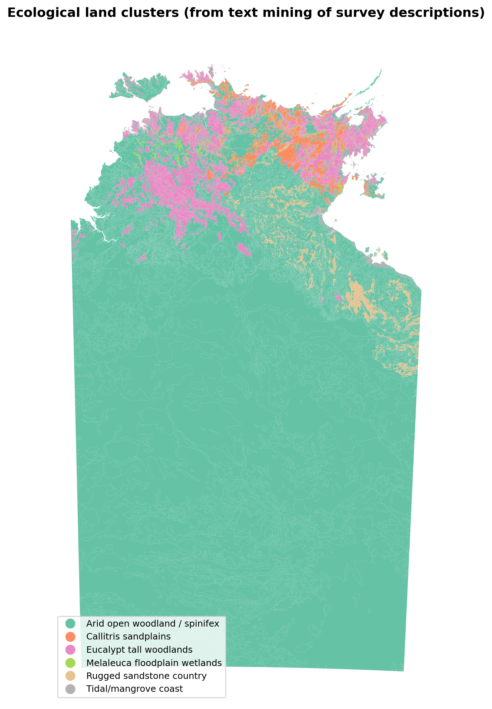
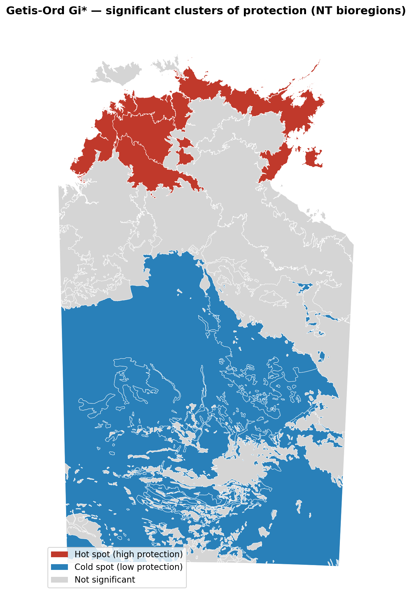

# Northern Territory Protected-Area Coverage

**[🌐 Live app](https://nt-protected-areas.vercel.app/) · [🔌 API](https://nt-protected-areas-api.onrender.com) · [📖 API docs](https://nt-protected-areas-api.onrender.com/docs)**

A full-stack spatial data science project examining whether the Northern Territory's
parks and reserves protect a representative cross-section of the Territory's land — or
whether protection is skewed toward certain landscapes while leaving others exposed.

> **Headline finding:** The NT reserve network significantly over-represents rugged,
> scenic northern country and significantly under-protects the arid interior. The
> Tanami — the Territory's single largest bioregion at ~538,000 km² — is a statistically
> significant cold spot of protection at just **0.6%** coverage.

> ⏳ *The live app's backend runs on a free tier that sleeps when idle, so the very
> first map load may take ~30–50 seconds while the server wakes. It's fast after that.*



---

## What this project is

Two complementary deliverables built on the same analysis:

1. **A Jupyter notebook** (`nt_protection_analysis.ipynb`) — the full analysis and
   reasoning, from raw spatial files to statistical conclusion.
2. **A deployed full-stack web app** — a FastAPI backend serving the analysis results
   as JSON, and a React + Leaflet frontend with an interactive map you can explore by
   bioregion, toggling between protection coverage and statistical hot/cold spots.

## The question

Protected-area networks are often shaped by scenery, accessibility, and history as much
as by ecological need. This project asks a measurable version of that concern: **does
protection coverage vary systematically by land type and by region, and is any pattern
statistically real rather than incidental?**

## Data

Three open datasets from the [NT Government Open Data Portal](https://data.nt.gov.au):

| Dataset | Format | Contents |
|---|---|---|
| NT Land Systems (NTLS 1M) | ESRI Shapefile | 16,831 land-system polygons with landform, soil, vegetation and class attributes |
| NT Parks and Reserves | ESRI Shapefile | 217 protected-area polygons with type and IUCN category |
| NT Land Mass / Coastline | File Geodatabase | Territory boundary, used for context and validation |

All published in GDA94 (EPSG:4283); areas computed after reprojection to Australian
Albers (EPSG:3577), an equal-area projection.

*Data snapshot retrieved June 2026; the analysis and the live app reflect the portal as
of that date. The underlying datasets (land systems, parks) are slow-changing, so the
snapshot remains representative.*

## Method

End to end, from raw spatial files to statistical conclusion:

1. **Data engineering** — load and reconcile two spatial formats (Shapefile + File
   Geodatabase), reproject to an equal-area CRS, repair invalid geometries, and validate
   computed areas against the known size of the Territory (~1.35M km² mapped against
   ~1.42M km² total — the gap is unmapped water and tidal zones).
2. **Protection by land class** — dissolve parks into a single protected-area layer (to
   avoid double-counting overlaps), then intersect with land systems to measure the
   protected fraction of each land class. Cross-validated by two independent routes that
   agree to within ~5%.
3. **Unsupervised learning** — structured features (bioregion + area) produced no
   meaningful clusters (silhouette < 0.22), so the approach pivoted to **TF-IDF text
   mining** of the free-text vegetation, soil and landform descriptions, yielding six
   interpretable ecological land groupings.
4. **Spatial statistics** — **Moran's I** to test whether protection is globally
   clustered across bioregions, and **Getis-Ord Gi\*** to locate significant hot and
   cold spots.

## Key results

### Protection is sharply uneven by land type

Against a Territory-wide average of ~5.1%, protection ranges from **33% for limestone
hills** down to **0% for salt pans**. The pattern tracks terrain: elevated, rugged
country is well protected, while flat arid country is barely covered. The two largest
land classes in the Territory — desert sandplains and dunefields — are among the
**least** protected.



### Text mining recovers six ecological land types

Clustering the survey descriptions independently rediscovered the same divide. Five
small, varied groupings (eucalypt woodlands, tidal/mangrove coast, Melaleuca wetlands,
rugged sandstone, Callitris sandplains) ring the north and are protected at 7–17%. One
dominant grouping — arid open woodland / spinifex — covers ~90% of the Territory and is
protected at just **4.1%**.



### The spatial pattern is statistically significant

Global **Moran's I = 0.227 (p = 0.032)** — protection is significantly spatially
clustered, though moderate rather than overwhelming. Local **Getis-Ord Gi\*** confirms
significant high-protection hot spots in the Top End north (Pine Creek, Darwin Coastal,
Arnhem Coast) and significant low-protection cold spots in the arid interior (Tanami,
Davenport Murchison Range, MacDonnell Ranges).



## Architecture

```
┌─────────────────────┐      HTTPS / JSON      ┌──────────────────────┐
│  React + Leaflet     │  ───────────────────▶  │  FastAPI (Python)     │
│  frontend (Vercel)   │                        │  backend (Render)     │
│  interactive map     │  ◀───────────────────  │  serves analysis JSON │
└─────────────────────┘                        └──────────────────────┘
```

- **Backend** (`backend/`) — FastAPI serving three endpoints (`/bioregions`,
  `/by-class`, `/by-cluster`) from pre-computed analysis output, with auto-generated
  OpenAPI docs at `/docs`.
- **Frontend** (`frontend/`) — React (Vite) + react-leaflet; choropleth map with a
  toggle between protection-coverage and Gi\* hot/cold-spot views, click-to-inspect
  bioregion stats.

## Limitations and notes

- **Moderate clustering, honestly reported.** Moran's I is significant but moderate
  (0.227); it would not survive a stricter p < 0.01 threshold.
- **Cluster over-merging.** TF-IDF grouped the arid interior into a single cluster
  because those land systems share similar survey vocabulary; in reality the desert
  contains more variation than one cluster implies.
- **Neighbourhood effects in Gi\*.** A few regions (e.g. Daly Basin, MacDonnell Ranges)
  are flagged as hot/cold spots that look counter-intuitive on their own values — correct
  behaviour, since Gi\* assesses a region together with its neighbours.
- **Salt pans at 0%** may be genuinely unprotected or reflect small protected slivers
  lost to water/gaps in the overlay; treated as a flagged edge case.

## Future work

- Re-cluster the arid interior at higher resolution.
- Run Gi\* at the land-system polygon level rather than aggregated bioregions.
- Weight protection by IUCN category, not just presence.

## Running locally

**Backend:**
```bash
cd backend
conda create -n ntapi python=3.11 -y
conda activate ntapi
pip install -r requirements.txt
uvicorn main:app --reload --port 8000
```

**Frontend:**
```bash
cd frontend
npm install
npm run dev   # opens on http://localhost:5173
```

To run the full analysis, download the three datasets from the NT Open Data Portal
(links above), unzip into `data/`, and run `nt_protection_analysis.ipynb` top to bottom.

## Tools

**Analysis:** Python · GeoPandas · scikit-learn · esda / libpysal (PySAL) · matplotlib
**App:** FastAPI · React (Vite) · Leaflet · deployed on Render + Vercel

---

*Data: © Northern Territory Government, NT Open Data Portal, used under Creative Commons
Attribution licence.*
